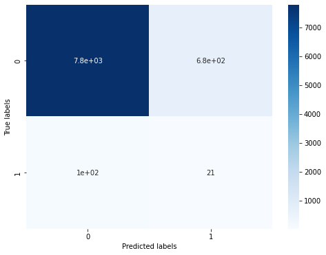

# Project Report

## Definition

### Project Overview

This project aims to enhance a German mail-order company's customer acquisition strategy. Key points:

   1. Data Analysis and Machine Learning
   1. Using Demographic Data from Arvato Financial Solutions
   2. Comparing the General Population to Current Customers
   3. Objective: Identifying Patterns That Distinguish Customers from Non-Customers
   4. Applying Machine Learning to Predict Customers
   5. Expected Outcome: Saving Resources with Targeted Advertising

### Problem Statement

**Problem**:  Dataset with response variable that represents whether an individual became a customer of the mail-order company after the campaign

**Strategy**: The data serves as a training set that will be used to build an optimal predictive algorithm for a separate data set for testing. Maybe need:
 - Algorithms and model: Classification
 - Data Preparation: Add/Remove/Transform Attributes
 - Feature Engineering

### Metrics

Source: https://machinelearningmastery.com/tour-of-evaluation-metrics-for-imbalanced-classification/


This choice is justified by several factors:

1. **Binary Classification**: Our problem involves predicting whether an individual is likely to become a customer or not, which is a binary classification task
   
2. **Predicting Class Labels**: The final decision is necessary; it is not about understanding the risks and making an informed decision(`Predicting Probabilities`).

3. **The positive class is more important**: Identifying potential customers holds greater value than focusing on excluding non-potential ones.
   
4. **Imbalanced Dataset**: The customer base is likely smaller than the general population, resulting in an imbalanced dataset.

=> Recall is an important metric when the focus is on capturing as many positive instances as possible, especially in cases of class imbalance or when the cost of false negatives is high

Additionally, we will use ROC AUC, precision, and F1-score to provide a more nuanced understanding of the model's performance, especially in terms of balancing false positives and false negatives in our customer predictions.

## Analysis

### Data Exploration

Key points from our data exploration phase:

1. Dataset Contents:
   - Dataset feature : 367 features (includes `RESPONSE`)
   - Explained feature in DIAS Attributes - Values 2017.xlsx
     - 'AGER_TYP', 'ALTERSKATEGORIE_GROB', 'ALTER_HH', 'ANREDE_KZ', ...
     - Total: 310
   - Unexplained features in DIAS Attributes - Values 2017.xlsx
     - 'CJT_TYP_4', 'CJT_TYP_6', 'KOMBIALTER', 'D19_VERSI_ONLINE_QUOTE_12', ...
     - Total: 57

2. Statistical Analysis:
   - RangeIndex: 42962 entries, 0 to 42961
   - Columns: 367 entries, LNR to ALTERSKATEGORIE_GROB
   - dtypes: float64(267), int64(94), object(6)
   - memory usage: 120.3+ MB

3. Data Sampling Insights:
- Number features
   	| LNR | AGER_TYP | AKT_DAT_KL | ALTER_HH | ALTER_KIND1 | ALTER_KIND2 | ALTER_KIND3 | ALTER_KIND4 | ALTERSKATEGORIE_FEIN | ANZ_HAUSHALTE_AKTIV |
   	|-----|----------|------------|----------|------------|------------|------------|------------|-----------------------|-------------------------|
   	| 1763 | 2 | 1.0 | 8.0 | NaN | NaN | NaN | NaN | 8.0 | 15.0 |
   	| 1771 | 1 | 4.0 | 13.0 | NaN | NaN | NaN | NaN | 13.0 | 1.0 |
   	| 1776 | 1 | 1.0 | 9.0 | NaN | NaN | NaN | NaN | 7.0 | 0.0 |
   	| 1460 | 2 | 1.0 | 6.0 | NaN | NaN | NaN | NaN | 6.0 | 4.0 |
   	| 1783 | 2 | 1.0 | 9.0 | NaN | NaN | NaN | NaN | 9.0 | 53.0 |

- Object features
   	| CAMEO_DEU_2015 | CAMEO_DEUG_2015 | CAMEO_INTL_2015 | D19_LETZTER_KAUF_BRANCHE | EINGEFUEGT_AM | OST_WEST_KZ |
   	|----------------|-----------------|-----------------|----------------------------|----------------|------------|
   	| 5D            | 5.0            | 34.0            | D19_UNBEKANNT            | 1992-02-10 00:00:00 | W          |
   	| 5B            | 5.0            | 32.0            | D19_TELKO_MOBILE          | 1997-05-14 00:00:00 | W          |
   	| 2D            | 2.0            | 14.0            | D19_LEBENSMITTEL          | 1995-05-24 00:00:00 | O          |
   	| 2D            | 2.0            | 14.0            | D19_UNBEKANNT            | 1992-02-10 00:00:00 | W          |
   	| 7B            | 7.0            | 41.0            | D19_BEKLEIDUNG_GEH        | 1992-02-10 00:00:00 | W          |

```python
mailout_train['CAMEO_INTL_2015'].unique()
```
```log
array([34.0, 32.0, 14.0, 41.0, 24.0, 33.0, nan, 25.0, 31.0, 22.0, 43.0,
     13.0, 55.0, 23.0, 54.0, 51.0, 45.0, 12.0, 44.0, 35.0, 15.0, 52.0,
     '23', '44', '14', '55', '51', '45', '43', '22', '54', '24', '25',
     '13', '12', '35', '33', '41', '15', '52', '31', '32', '34', 'XX'],
    dtype=object)
```

1. Identified Data Abnormalities:


Columns with more than 30% missing values:

   ['AGER_TYP', 'ALTER_KIND1', 'ALTER_KIND2', 'ALTER_KIND3', 'ALTER_KIND4', 'D19_BANKEN_ANZ_12', 'D19_BANKEN_ANZ_24', 'D19_BANKEN_DATUM', 'D19_BANKEN_DIREKT', 'D19_BANKEN_GROSS', 'D19_BANKEN_LOKAL', 'D19_BANKEN_OFFLINE_DATUM', 'D19_BANKEN_ONLINE_DATUM', 'D19_BANKEN_REST', 'D19_BEKLEIDUNG_GEH', 'D19_BEKLEIDUNG_REST', 'D19_BILDUNG', 'D19_BIO_OEKO', 'D19_BUCH_CD', 'D19_DIGIT_SERV', 'D19_DROGERIEARTIKEL', 'D19_ENERGIE', 'D19_FREIZEIT', 'D19_GARTEN', 'D19_GESAMT_ANZ_12', 'D19_GESAMT_ANZ_24', 'D19_GESAMT_OFFLINE_DATUM', 'D19_GESAMT_ONLINE_DATUM', 'D19_HANDWERK', 'D19_HAUS_DEKO', 'D19_KINDERARTIKEL', 'D19_KOSMETIK', 'D19_LEBENSMITTEL', 'D19_LOTTO', 'D19_NAHRUNGSERGAENZUNG', 'D19_RATGEBER', 'D19_REISEN', 'D19_SAMMELARTIKEL', 'D19_SCHUHE', 'D19_SONSTIGE', 'D19_TECHNIK', 'D19_TELKO_ANZ_12', 'D19_TELKO_ANZ_24', 'D19_TELKO_DATUM', 'D19_TELKO_MOBILE', 'D19_TELKO_OFFLINE_DATUM', 'D19_TELKO_ONLINE_DATUM', 'D19_TELKO_REST', 'D19_TIERARTIKEL', 'D19_VERSAND_ANZ_12', 'D19_VERSAND_ANZ_24', 'D19_VERSAND_DATUM', 'D19_VERSAND_OFFLINE_DATUM', 'D19_VERSAND_ONLINE_DATUM', 'D19_VERSAND_REST', 'D19_VERSI_ANZ_12', 'D19_VERSI_ANZ_24', 'D19_VERSICHERUNGEN', 'D19_VOLLSORTIMENT', 'D19_WEIN_FEINKOST', 'EXTSEL992', 'GEBURTSJAHR', 'KBA05_BAUMAX', 'KK_KUNDENTYP', 'TITEL_KZ']

   

1. Preprocessing Needs:
   - Data Cleaning:
     - Address missing values through imputation or removal
     - Correcting Errors such as typos or incorrect formats.
   - Feature Engineering: `describe as below`
   - Data Reduction
     - Sampling: using techniques like random sampling or stratified sampling to create a manageable subset

2. Feature Engineering Opportunities:
   - Creating New Features from `EINGEFUEGT_AM`
   - Encoding Categorical Variables for `D19_LETZTER_KAUF_BRANCHE`, `CAMEO_DEU_2015`, `OST_WEST_KZ`
   - Handling Missing Values include as Imputation

3. Conclusion:
   - Thorough data preprocessing required for reliable subsequent analysis and modeling
   - Rich dataset with potential for insightful customer segmentation and prediction

### Exploratory Visualization

``` log
Number of negative responses (RESPONSE = 0) in clean_mailout_train: 42430 (98.76%)
Number of positive responses (RESPONSE = 1) in clean_mailout_train: 532 (1.24%)
```


The problem with the dataset is imbalance

### Algorithms and Techniques

We will consider the following approaches to handle it:
1. Oversampling the minority class.
2. Undersampling the majority class.
3. Rely on cost-sensitive learning- parameters like `is_unbalanced`, `class_weight`, `scale_pos_weight`
4. Implement Self-Training and Semi-Supervised Learning

### Benchmark

| Model Name | Technique | ROC_AUC | Recall | Precision | F1 Score | Accuracy |
|------------|-----------|---------|-------|----------|----------|----------|
|XX|XX|0|0|0|0|0

The table above is the benchmark result for comparing solutions. ROC AUC, recall, and F1 are the main scores that we need to focus on. Other scores are considered as costs that need to be improved if possible.

## Methodology

### Data Preprocessing

1. Exact data `from DIAS Attributes - Values 2017.xlsx`, detect unknow data in each feature
   ``` log
   Total number of rows with unknown values: 288
   ```
2. Detect stranger character in feature has `object` datatype like `XX` and `X`
   ``` python
   for column in azdias.select_dtypes(include=['object']):
      print(f'Feature: {column}')
      print(azdias[column].unique())
   ```
   ``` log
   Feature:
   ['9' 4.0 '4' 3.0 nan 9.0 '2' '8' 2.0 '1' '7' '5' 8.0 7.0 '3' '6' 6.0 5.0 1.0 'X']
   ```
3. Replace `XX` and `X` Values with `NaN`
   1. Columns `CAMEO_INTL_2015` and `CAMEO_DEU_2015` have **XX** values replaced with NaN.
   2. Column `CAMEO_DEUG_2015` has **X** values replaced with NaN.
4. Convert String Values to Float
   1. Convert `CAMEO_DEUG_2015` and `CAMEO_INTL_2015` columns from `string` to `float32`.
5. Convert to Category Codes
   1. Convert categorical columns to their respective category codes. (`D19_LETZTER_KAUF_BRANCHE`, `CAMEO_DEU_2015`, `OST_WEST_KZ`)
6. Feature Engineering on Datetime Feature
   1. Convert `EINGEFUEGT_AM` to datetime and extract `hour`, `day_of_week`, and `month`.
   2. Drop the original `EINGEFUEGT_AM` column.
7. Replace `unknown` value with `NaN` - feature take from step **(1)**
   1. Replace special values (-1, 0, 9, 10) with `NaN` for specific feature groups.
8. Remove Features
   1. Drop columns with more than 30% `NaN` values.
9.  Ensure Consistency in Data Formats
   1.  Convert `int64` columns to `int32` and `float64` columns to `float32`.
10. Drop the useless columns
    1.  Drop the `LNR` column if it exists.


### Implementation

The process for which metrics, algorithms, and techniques were implemented with the given datasets or input data has been thoroughly documented. Complications that occurred during the coding process are discussed.
1. Metrics
   1. `cal_metrics`: This function evaluates the overall performance of the model by `calculating AUC`, generating a `classification report`, and `visualizing the confusion matrix`.
2. Algorithms
   1. Random Forest Classifier model
      1. a robust
      2. easy-to-interpret model 
      3. performs well on small datasets
   2. Xboost model
      1. Dealing with complex datasets - Can handle `NaN` data
      2. High performance
      3. Can invest time in hyperparameter tuning.
3. Technique
   1. Data Preprocessing
      1. Handling missing values (2 options)
         1. Replace `NaN` by mean / median /...
         2. Keep it as is and choose a model that can handle `NaN` data such as `Xboost`, `CatBoost`
      2. Feature Engineering
      3. Encoding categorical variables
      4. Remove features with more than 40% missing (`NaN`) values
   2. Handling Class Imbalance
      1. Resampling Techniques
      2. Algorithmic Approaches - class weighting
   3. Model Evaluation
      1. splitting the data into training and validation sets
      2. identify and calculate metrics

### Refinement

The process of improving upon the algorithms and techniques used is clearly documented. Both the initial and final solutions are reported, along with intermediate solutions, if necessary.

1. Find the best hyperparameters using `GridSearchCV`
   
   1.1. Implement
   ``` python
   smote_tom_rf = GridSearchCV(random_smotetom_pipeline, param_grid=new_params, cv=kf, scoring='recall',       return_train_score=True, verbose=1, n_jobs=-1)
   ``` 

2. Resampling Techniques
   
   2.1. Implement
   ``` python
   random_smotetom_pipeline = ImbPipeline([
      ('smote', SMOTETomek(random_state=42)),
      ('classifier', RandomForestClassifier(random_state=13))
   ])
   ```
   2.2. Result

   ``` log
   Random Forest - Validation AUC: 0.6577
   Model Performance Results:
                 precision    recall  f1-score   support

            0.0       0.99      0.92      0.95      8472
            1.0       0.03      0.17      0.05       121

       accuracy                           0.91      8593
      macro avg       0.51      0.55      0.50      8593
   weighted avg       0.97      0.91      0.94      8593
   ```

   

3. Algorithmic Approaches - Class Weighting
   
   3.1. Implement
   ``` python
   # Fixed class_weight
   rfb = RandomForestClassifier(n_estimators=100, random_state=13, class_weight=class_weights)
   ```
   3.2. Result
   
   | Model Name | Technique | ROC_AUC | Recall | Precision | F1 Score | Accuracy |
   |------------|-----------|---------|-------|----------|----------|----------|
   | Random Forest | class_weight | 0.736374 | 0.495413 | 0.033687 | 0.063084 | 0.813326 |

   

4. Class Weighting and Self Training
   4.1. Implement
   ``` python
   rf_classifier = RandomForestClassifier(**hyperparameters, class_weight=class_weights)

   classifier, iterations, test_recalls, pseudo_labels = self_train(rf_classifier, X_train_impute, y_train, X_val_impute, y_val, test_data.copy())
   ```
   4.2. Result

   | Model Name | Technique | ROC_AUC | Recall | Precision | F1 Score | Accuracy |
   |------------|-----------|---------|-------|----------|----------|----------|
   | Random Forest | class_weight & self_training | 0.736648 | 0.495413 | 0.033750 | 0.063195 | 0.813675 |

   


## Results

### Model Evaluation and Validation

The best model is:
| Model Name | Technique | ROC_AUC | Recall | Precision | F1 Score | Accuracy |
|------------|-----------|---------|-------|----------|----------|----------|
| `XGBoost` | `scale_pos_weight & self_training` | **0.768915** | **0.701835** | **0.035027** | **0.066725** | 0.750946 |

* Important features


* AUC-ROC Curve


* Precision-Recall Curve (PR curve)


### Justification

| Model Name | Technique | ROC_AUC | Recall | Precision | F1 Score | Accuracy |
|------------|-----------|---------|-------|----------|----------|----------|
| Random Forest | RandomOverSampler | 0.729993 | 0.541284 | 0.027936 | 0.053129 | 0.755252 |
| Random Forest | SMOTE | 0.636855 | 0.133028 | 0.028856 | 0.047424 | **0.932208** |
| Random Forest | SMOTE Tomek | 0.636855 | 0.133028 | 0.028856 | 0.047424 | **0.932208** |
| Random Forest | SMOTE ENN | 0.652443 | 0.321101 | 0.029724 | 0.054411 | 0.858423 |
| Random Forest | class_weight | 0.736374 | 0.495413 | 0.033687 | 0.063084 | 0.813326 |
| Random Forest | class_weight & self_training | 0.736648 | 0.495413 | 0.033750 | 0.063195 | 0.813675 |
| XGBoost | scale_pos_weight | 0.768904 | **0.701835** | 0.035003 | 0.066681 | 0.750771 |
| `XGBoost` | `scale_pos_weight & self_training` | **0.768915** | **0.701835** | **0.035027** | **0.066725** | 0.750946 |

* Since the project dataset is imbalanced, so higher ROC_AUC and recall scores are positive signs.


## References

- https://www.kaggle.com/code/marcinrutecki/best-techniques-and-metrics-for-imbalanced-dataset
- https://www.analyticsvidhya.com/blog/2020/10/improve-class-imbalance-class-weights/
- https://towardsdatascience.com/a-gentle-introduction-to-self-training-and-semi-supervised-learning-ceee73178b38
